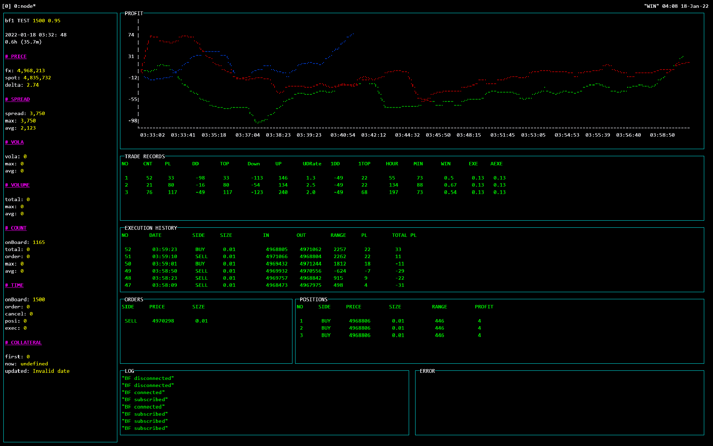

## Bot System



### Install

```shell
> git clone  https://github.com/web3ten0/bot-system
> cd bot-system
> npm install
```

### Setting

- `.env`ファイルを作成し、下記を記入します。

```.env
BOT_NAME=bf-bot
BF_API_KEY=*****
BF_SECRET=*****
```

### Strategyの作成

- `strategies/bf/Strategy1.js`にサンプルのストラテジーがあります。
- 上記を修正して、ストラテジーを作成します。
- 実行したいストラテジーを`strategies.js`に登録します。
  - `strategies.js`は、リポジトリのルートにあります。
- 下記の`strategies.js`の例は3つのストラテジーを並行して実行します。

```strategies.js
const Strategy = require('./strategies/bf/Strategy1')

const strategies = [
  new Strategy({
    minSpread: 1500,
  }),
  new Strategy({
    minSpread: 2000,
  }),
  new Strategy({
    minSpread: 750,
  }),
]

module.exports = strategies
```

### 実行

- 通常モードでの実行
  - 上記のような各種プライス情報やトレード結果の数値・グラフが表示されます。
  - 下記の場合、テストモードでの実行されます。
  - 終了するには、 `Ctrl+c` で取引終了し、 `Ctrl+x` で画面が閉じます。

```shell
> node index.js bot
```

- CLIモード

```shell
> node index.js bot-cli
```

- 本番モードでの実行

```shell
> node index.js bot pro
> node index.js bot-cli pro
```

- バックテスト用データ蓄積モード

```shell
> node index.js data
```

- バックテスト

```shell
> node index.js test 2022-01-18 0:00 3:00
> node index.js test latest
> node index.js test-graph 2022-01-18 0:00 3:00
> node index.js test-graph latest
```

